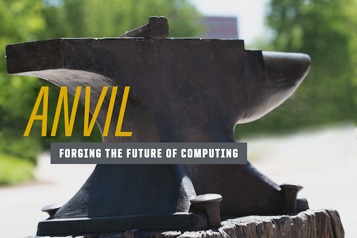
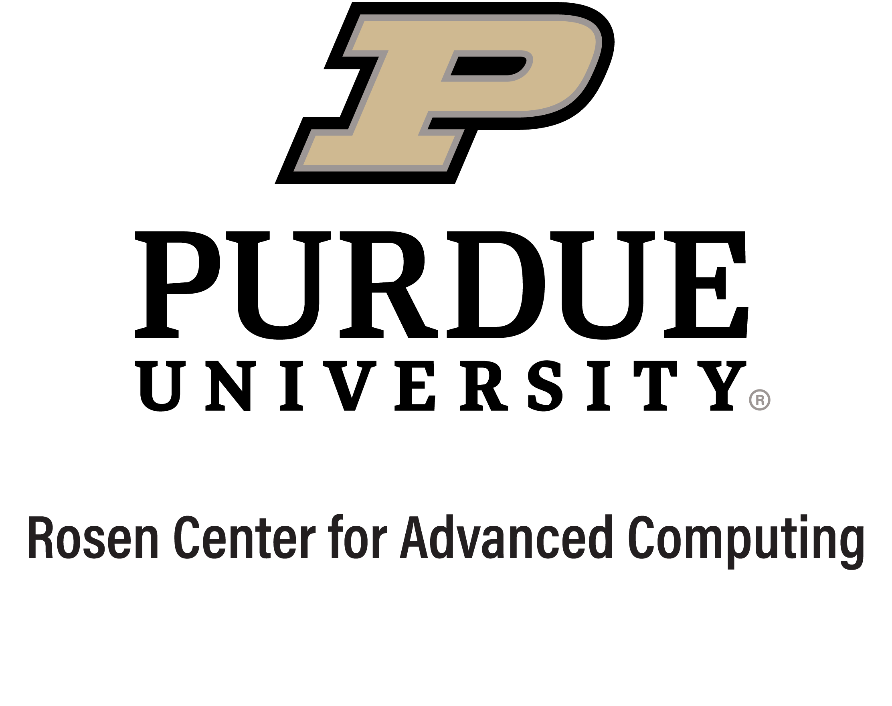

# Welcome to Hands-On with Anvil!

### What is Anvil?
Anvil, located at the [Rosen Center for Advanced Computing](https://rcac.purdue.edu/) at Purdue University is a [top ranked](https://top500.org/system/180085/) supercomputer dedicated to open scientific research. It has lots of features that we'll explore today, including:

- 64-core AMD “Optimized 3rd Gen EPYC” CPUs (x 2,096)
- NVIDIA A100 GPUs (x64)
- Single-Node performance of about 5TF (x 1,048)

### Navigating this Session
Here you will find the [session agenda](agenda.md) along with various resources
to help get you up and running on Anvil. We'll take a deep look at the
system's design, discuss how research teams write programs for and run
workloads on Anvil, and you'll get to run on your own. The session is guided by
hands-on [***challenges***](challenges). 

The [first challenge](./challenges/Access_Anvil_and_Clone_Repo) is to
successfully log into Anvil and clone this repository.

Each challenge has its own sub-directory under `/challenges/`, and includes a
README.md file and any additional files for that challenge. Challenges range in
difficulty from introductory to very complex, and may require research and
reference materials outside of what's provided in this repository.

&nbsp;

### Helpful Links

#### [   Official Anvil User Guide & Documentation](https://www.rcac.purdue.edu/knowledge/anvil)

#### [   SchedMD Slurm Documentation (scheduler)](https://slurm.schedmd.com/documentation.html)

 

 

  

